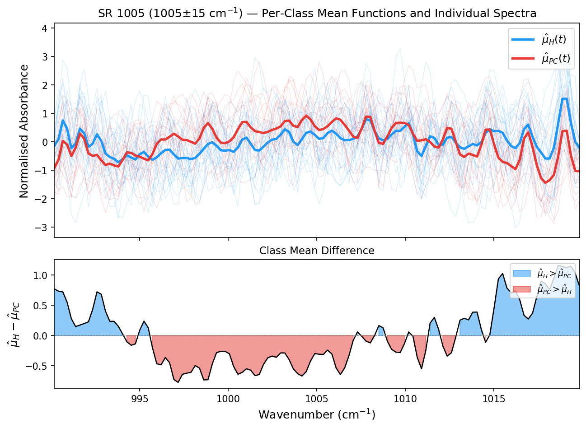
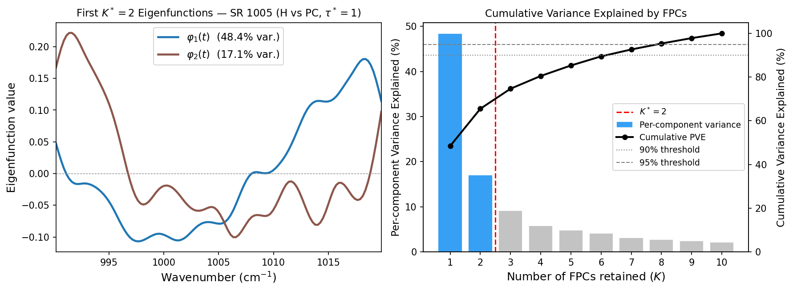

# Urogenital Cancer Classification from Breath IR Spectra

**Master's Thesis project — Technische Universität München (TUM), Department of Mathematics.**

This repository contains the full implementation accompanying the thesis *"Functional Support Vector Machines for Disease Classification based on Infrared Spectroscopy"* (2025). The project replicates and extends [Maiti et al. 2021](https://doi.org/10.1021/acs.analchem.0c04761): binary classification of urogenital cancers from mid-infrared Fourier-transform breath spectroscopy using a classical SVM pipeline and a novel Functional SVM (FSVM) pipeline.

The clinical motivation: PSA, the standard screening test for prostate cancer, achieves roughly 70% sensitivity at 60% specificity. Non-invasive breath-based screening that could match or exceed this threshold without a blood draw would be clinically valuable. This project investigates whether mid-IR spectral signatures in exhaled breath carry sufficient discriminatory information.

---

## Dataset

70 participants total: 26 healthy (H), 28 prostate cancer (PC), 8 kidney cancer (KC), 8 bladder cancer (BC). Split into a modelling set and a strictly held-out blind evaluation set collected one year later.

| Cohort      | Modelling set | Blind set | Total |
|-------------|:-------------:|:---------:|:-----:|
| Healthy (H) | 22            | 4         | 26    |
| Prostate (PC) | 17          | 11        | 28    |
| Kidney (KC) | 3             | 5         | 8     |
| Bladder (BC) | 5            | 3         | 8     |
| **Total**   | **47**        | **23**    | **70**|

Two binary classification tasks:
- **Task I — H vs. PC**: 39 modelling samples, 15 blind samples.
- **Task II — H vs. KC+BC+PC**: 47 modelling samples, 23 blind samples.

---

## Results

Performance is reported across eight biologically motivated spectral ranges (SRs). The key comparisons are on the blind evaluation set (held out throughout all model development), using Matthews Correlation Coefficient (MCC) as the primary metric given class imbalance.

### Classical SVM — Cross-Validation Performance (LOOCV)

| SR | Task I (H vs. PC) LOOCV Acc. | Task II (H vs. KC+BC+PC) LOOCV Acc. |
|---|:---:|:---:|
| SR 1005 | **0.897** | 0.766 |
| SR 530  | 0.718 | 0.766 |
| SR 1050 | 0.692 | 0.745 |
| SR 1130 | 0.692 | 0.745 |
| SR 1170 | 0.821 | **0.809** |
| SR 1190 | 0.385 | 0.702 |
| SR 1203 | 0.513 | 0.766 |
| SR 2170 | 0.564 | 0.532 |
| concat_all | 0.846 | 0.681 |

### FSVM — Cross-Validation Performance (LOOCV)

| SR | Task I (H vs. PC) LOOCV Acc. | Task II (H vs. KC+BC+PC) LOOCV Acc. |
|---|:---:|:---:|
| SR 1005 | **0.821** | 0.809 |
| SR 530  | 0.692 | 0.787 |
| SR 1050 | 0.615 | 0.723 |
| SR 1130 | 0.744 | 0.702 |
| SR 1170 | 0.641 | **0.830** |
| SR 1190 | 0.795 | 0.787 |
| SR 1203 | 0.692 | 0.702 |
| SR 2170 | 0.436 | 0.532 |
| concat_all | 0.692 | 0.702 |

### Head-to-Head: Blind Set (best configuration per pipeline and task)

| Task | Pipeline | Best SR | Blind Acc. | Sens. | Spec. | MCC |
|------|----------|---------|:----------:|:-----:|:-----:|:---:|
| H vs. PC | Classical SVM | SR 1005 | 0.533 | 0.364 | 1.000 | +0.364 |
| H vs. PC | **FSVM** | **SR 1190** | **0.733** | **0.727** | **0.750** | **+0.431** |
| H vs. KC+BC+PC | Classical SVM | concat_all | 0.478 | 0.368 | 1.000 | +0.303 |
| H vs. KC+BC+PC | FSVM | SR 1005 | 0.565 | 0.579 | 0.500 | +0.060 |

All sensitivity and specificity estimates on the blind set are accompanied by exact Clopper–Pearson 95% confidence intervals in the thesis; with only 4 healthy patients in both blind sets, specificity estimates carry high uncertainty and should be interpreted accordingly.

**Permutation tests** (B = 1,000 label shuffles) confirmed that the LOOCV accuracy of the best FSVM configurations is statistically significant: p = 0.003 for Task I (SR 1005, acc = 0.821) and p = 0.001 for Task II (SR 1170, acc = 0.830).

### Key Findings

- **SR 1005 is the most discriminative spectral range** in every pipeline–task combination, consistent with the prior study. SR 2170 (CO absorption band) is uninformative in all settings.
- **The Classical SVM achieves higher peak CV accuracy** (89.7% LOOCV for Task I) but the FSVM generalises slightly better to the blind set for Task I (MCC +0.431 vs +0.364), suggesting the FPCA-based noise reduction helps.
- **The FSVM achieves extreme dimensionality reduction**: for Task I, a single FPC score per patient was sufficient for classification (K* = 1). The FACE covariance estimator and BLUP score shrinkage together act as a built-in noise filter, removing the need for the explicit Gaussian smoothing step in the classical pipeline.
- **Task II blind-set generalisation failed for both pipelines.** No configuration achieved MCC > +0.303 on the held-out set for H vs. KC+BC+PC, reflecting the small training set (n = 47) and the within-group heterogeneity of pooling three distinct cancer types. The most honest interpretation is that the dataset is too small to draw firm conclusions for this task.

---

## Repository Structure

```
.
├── src/
│   ├── baseline_correct.py          # Multi-stage baseline correction (1st/2nd/3rd order)
│   └── BaselineCorrect_pipeline.ipynb
│
├── classical_SVM_pipeline/
│   ├── SVM_implement.py             # SVMBreathClassifier: LOOCV, k-fold, blind eval
│   ├── grid_search.py               # Nested CV over hyperparameter grid
│   ├── sr_preprocessing.py          # Extract & normalise spectral range windows
│   ├── SVM_notebook.ipynb
│   └── eval_result_data/            # Output CSVs (git-ignored)
│
├── FSVC/
│   ├── fsvm_implement.py            # FPCA via R (rpy2) + SVM on BLUP FPC scores
│   ├── FSVM_notebook.ipynb
│   └── eval_result_data/            # Output CSVs (git-ignored)
│
├── exploratory_notebooks/
│   └── exploratory_BaselineInvariance/   # (Exploratory only — not part of thesis evaluation)
│       ├── models.py                # 1D CNN encoder + NT-Xent contrastive loss
│       ├── train.py
│       ├── augment.py               # Spectral augmentations (baseline, fringe, noise)
│       └── evaluate.py
│
├── ALLDataGross/                    # Raw .dpt spectra — git-ignored
├── data_processed/                  # Cached preprocessed data — git-ignored
└── requirements.txt
```

---

## Pipeline

### 1. Baseline Correction
Run `src/BaselineCorrect_pipeline.ipynb`.

Applies a 3-stage hierarchical correction to raw `.dpt` spectra following Roy & Maiti (2024):
1. Normalise by sample-specific reference absorbance
2. Uniform vertical shift using a quiet reference region (2550–2600 cm⁻¹)
3. Segment-wise polynomial fitting across 3 spectral windows

Outputs cached to `data_processed/dataprocessedbreath_data.pkl`.

### 2. Classical SVM
Run `classical_SVM_pipeline/SVM_notebook.ipynb`.

Replicates the pipeline of Maiti et al. (2021):
- Features: 8 spectral range (SR) windows of ±15 cm⁻¹, optionally reduced with PCA (4 components)
- Hyperparameter search: joint stratified 5-fold CV over kernel, C, γ, and Gaussian smoothing σ
- Evaluation: LOOCV (primary), repeated 9-fold CV (10 repetitions), blind set

### 3. Functional SVM (FSVM)
Run `FSVC/FSVM_notebook.ipynb`.

<p align="center">
  
  <br>
  <em>Per-class mean functions and individual spectra for SR 1005 (1005 ± 15 cm⁻¹), H vs. PC modelling set. The lower panel shows the signed mean difference μ̂<sub>H</sub> − μ̂<sub>PC</sub>; regions shaded blue (red) indicate wavenumbers where healthy (prostate cancer) absorbance is higher on average.</em>
</p>

Implements the framework of Xie & Ogden (2024) applied to breath spectroscopy:
- **FPCA via `refund::fpca.face()`** (FACE algorithm, Xiao et al. 2016) — called from Python via `rpy2`
- **BLUP score estimation** with noise shrinkage (signal-to-noise weighting per eigenfunction)
- Joint tuning of FACE smoothing parameter τ, number of FPCs K, and SVM regularisation C
- Gaussian kernel bandwidth γ determined automatically via the `sigest` heuristic (kernlab)

<p align="center">
  
  <br>
  <em>Left: first two FPCA eigenfunctions φ<sub>1</sub> (48.4% variance) and φ<sub>2</sub> (17.1% variance) for SR 1005, H vs. PC, τ* = 1. Right: per-component and cumulative proportion of variance explained (PVE); the red dashed line marks the selected K* = 2.</em>
</p>

The Python/R bridge (`fpca_face_via_r()` in `fsvm_implement.py`) handles serialisation of the spectral matrix to R, calls `fpca.face`, and returns eigenfunctions and BLUP scores to Python. One non-obvious implementation detail: `λ = 0` must be passed with an explicit `None`-check rather than a Python truthiness test, since `if lam` silently drops zero values from the R call.

### 4. Baseline-Invariant Encoder (Exploratory)
Run `exploratory_notebooks/baseline_invariant_contrastive_encoder.ipynb`.

An exploratory direction not included in the thesis evaluation. A 1D CNN trained with NT-Xent contrastive loss, where augmentations simulate baseline variability (polynomial drift, fringes, scaling, noise). The goal was to learn representations invariant to baseline artefacts without requiring explicit correction. Evaluated qualitatively via UMAP embeddings and positive/negative pair distances; not sufficiently mature for quantitative comparison.

---

## Installation

```bash
python -m venv venv
source venv/bin/activate
pip install -r requirements.txt
```

**R dependency** (required for FSVM only):

```r
install.packages("refund")
```

---

## Data Format

Raw spectra are stored as `.dpt` files (comma or whitespace-delimited wavenumber/intensity pairs, ~14,500 points per spectrum). The data are not publicly available as they originate from a clinical study.

| Cohort              | Path                           | Notes                        |
|---------------------|--------------------------------|------------------------------|
| Healthy (H)         | `ALLDataGross/healthyCohort/`  | 22 modelling + 4 blind        |
| Cancer (KC/PC/BC)   | `ALLDataGross/allKgData/`      | Modelling set                |
| Blind evaluation    | `ALLDataGross/BlindData/`      | Held out throughout          |

---

## References

- Maiti et al. (2021). *Breath Analysis Using IR Spectroscopy for Urogenital Cancer Detection.* Analytical Chemistry. https://doi.org/10.1021/acs.analchem.0c04761
- Xie & Ogden (2024). *Functional Support Vector Machine.* Biostatistics, 25(4):1178–1194.
- Xiao et al. (2016). *Fast Covariance Estimation for Sparse Functional Data.* Statistics and Computing.
- Roy & Maiti (2024). *Baseline correction methodology for IR breath spectra.*
